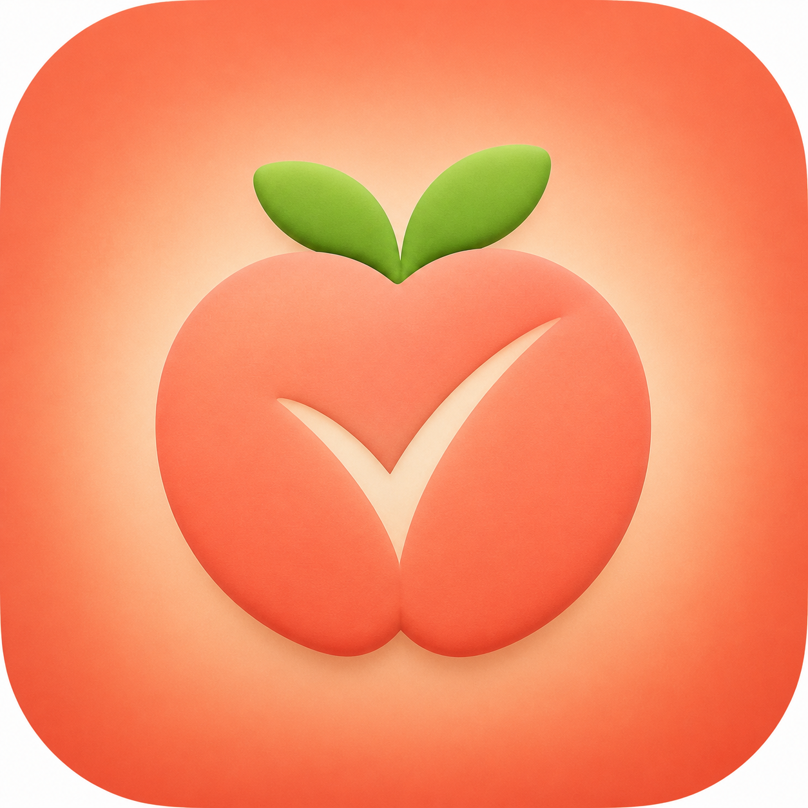
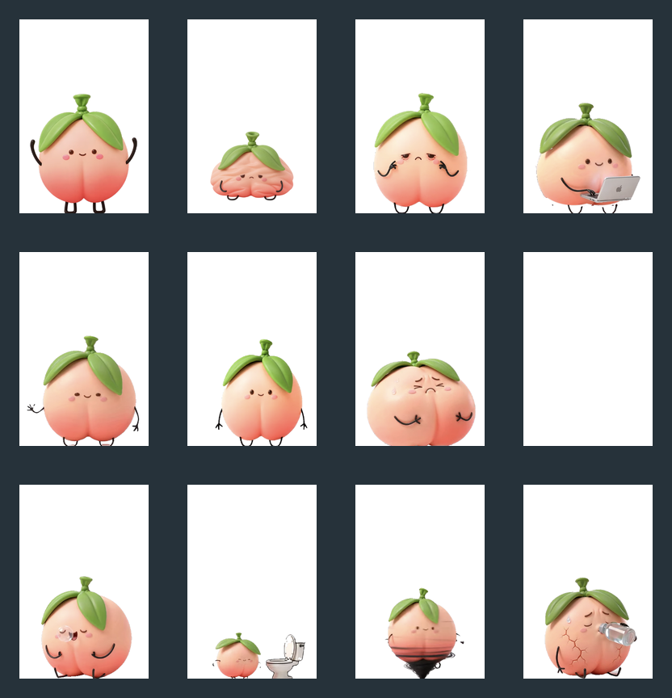

<p align="center">
  
</p>

<h1 align="center">Peach Butt / 桃屁屁</h1>

<p align="center">个人效率管理的宠物陪伴 · A desktop pet companion for personal productivity</p>

<p align="center">
  <a href="https://www.electronjs.org/"></a>
  <a href="https://github.com/yyz666ai/Peach-Butt/actions/workflows/ci.yml"></a>
  <a href="LICENSE"></a>
  <a href="#privacy--local-data"></a>
  <a href="#development--checks"></a>
</p>

<p align="center"><a href="#中文">中文</a> · <a href="#english">English</a></p>

---

<a id="中文"></a>

## 中文

桃屁屁是一个常驻桌面的健康陪伴宠物：它陪你专注、提醒喝水和休息，并把真实的休息反馈沉淀为个人效率记录。重点不是“盯着你”，而是用一个有状态、有反馈的角色，把健康节奏放进每天的工作流。

<p align="center">
  
</p>

### 特性

- 透明、置顶、可拖动的桌宠；点击、悬停与右键菜单提供交互。
- 番茄专注、短休息与长休息节奏；Mac 菜单栏与 Windows 任务栏/托盘提供倒计时和进度。
- 使用固定镜头透明动效：待机、打招呼、变身、安静敲键盘、活动、喝水、如厕、护眼、睡觉、压力、爆炸和恢复。
- 每轮休息依次提示活动、喝水、如厕、护眼；完成后会从本轮队列移除。
- 连续专注过长时，桃屁屁会逐渐变红、膨胀；未休息会爆炸并进入瘪气锁定，连续离开电脑休息满 5 分钟后恢复。
- 健康分每日从 0 开始。行为有不同权重和每日计分上限；爆炸阶梯扣分为 15 / 30 / 50，分数不会低于 0。
- 桃桃小屋提供近 7 天趋势、行为统计和状态时长；完整历史在本机持续保存。所有数据保存在本机 SQLite。

### 交互流程

```text
开始专注 → 变身 → 安静敲键盘
    ↓ 番茄结束 / 连续专注过长
点击宠物确认休息 → 活动 → 喝水 → 如厕 → 护眼 → 返回待机

忽略休息 → 变红膨胀 → 爆炸 → 瘪气锁定
    ↓ 点击开始恢复后，连续系统空闲 5 分钟
恢复变身 → 待机 / 可再次专注
```

专注期间点击宠物只会提示“保持专注”，不会退出专注。右键菜单用于开始、暂停或取消专注，以及记录健康行为；桌宠气泡只放一句提示，不把操作面板堆在角色身上。

### 截图与视觉验收

| 桃桃小屋 | 桌宠状态 |
| --- | --- |
|  |  |

当前桌宠状态、动作切换和界面交互详见[《桃屁屁当前交互与动作切换说明》](docs/product-interaction-logic.md)。产品设计与实现说明见 [`docs/sdd`](docs/sdd)，视频处理方法见 [`docs/video-asset-workflow.md`](docs/video-asset-workflow.md)。

### 隐私与本地数据

- 不需要账号，也不把提醒、行为或统计上传到服务器。
- 健康分、提醒反馈、专注/休息状态和统计存储在应用本机的 SQLite 数据库。
- 应用直接使用仓库内的透明 WebM；含创作平台元数据的原始母带不进入公开仓库，日常使用不需要 Python、`rembg` 或模型下载。

### 使用

目前仓库不提供经验证的公开下载链接。请从源码构建，或由维护者提供已签名的发布包。

#### macOS

```bash
npm install
npm run dev
```

构建本地应用目录：

```bash
npm run dist:mac
```

构建产物写入 `release/`。未签名或未公证的开发构建，首次打开时可能需要在 Finder 中右键选择“打开”。Apple Silicon 与 Intel Mac 应分别在对应架构环境中构建和验证。

#### Windows

在 Windows 10/11 上安装 Node.js 的当前 LTS 版本后运行：

```powershell
npm install
npm run dev
npm run dist:win
```

NSIS 安装包写入 `release/`。建议在 Windows 机器或 Windows CI 上构建 Windows 包，以便正确处理原生依赖；未签名的测试包可能触发 SmartScreen。

### 开发

```bash
npm install
npm run dev
```

常用校验：

```bash
npm run assets:check
npm run videos:check
npm run typecheck
npm test
npm run build
```

项目主要目录：

```text
src/main/          Electron 主进程、系统状态、SQLite 运行时
src/renderer/      桌宠与桃桃小屋界面
src/core/          番茄、健康分、提醒、恢复与平台状态规则
assets/video/      透明 WebM、动作清单与母带放置说明
assets/dashboard/  统计页的独立 3D 图片素材
docs/              产品设计、任务和视觉/视频验收记录
```

### 视频素材流水线

新增动作前，请把你拥有发布权的原始视频放入本地 `assets/video/source/`，完整查看并确认固定镜头、主体比例、循环段和需要去掉的尾帧；不要直接把整段视频循环播放。公开仓库不包含项目原始母带。

```bash
# 首次制作环境：详见下方文档
python3 -m venv .venv-video
.venv-video/bin/python -m pip install -r scripts/requirements-video.txt

# 生成透明 VP9 Alpha WebM 并验证
npm run videos:build
npm run videos:check
```

完整流程包括抽帧、主体分割、透明边缘修复、统一 480 × 500 画布和底部锚点、裁剪循环尾帧、更新 `assets/video/manifest.json` 以及深色/棋盘背景验收。详见 [`docs/video-asset-workflow.md`](docs/video-asset-workflow.md)。

### 路线图

- [x] 透明桌宠、番茄、休息队列、健康分和本地统计
- [x] 视频驱动的角色状态、全屏爆炸与恢复锁定
- [x] macOS 菜单栏与 Windows 任务栏状态适配
- [ ] 真实 Windows 安装包的跨版本实机验收
- [ ] 签名与公证的公开发布流程
- [ ] 更多可选提醒动作与无障碍偏好设置
- [ ] 可选的本地对话能力（默认保持离线）

### 贡献

欢迎提交问题、复现步骤、动效素材建议和代码改进。提交前请：

1. 保持角色素材与参考图的比例、短腿和底部锚点一致。
2. 为状态机或计分逻辑补充测试。
3. 运行上面的校验命令；涉及视频时还需运行 `npm run videos:check`。
4. 不提交用户数据库、构建产物、原始隐私数据或未授权素材。

### 许可证

代码以 [MIT License](LICENSE) 开源。角色 IP、品牌名称和原创美术素材的商用或再发行请先联系维护者取得授权，避免让代码许可证与角色授权混淆。

---

<a id="english"></a>

## English

Peach Butt is a desktop pet companion for personal productivity. It turns focus sessions, healthy breaks, and local habits into a gentle, visible workflow—without sending personal activity data to a server.

<p align="center">
  
</p>

### Highlights

- Transparent, always-on-top, draggable desktop pet for macOS and Windows.
- Pomodoro focus, short/long breaks, menu-bar/taskbar countdowns, and hover feedback.
- Authored transparent video motion for greeting, transformation, focused work, breaks, pressure, explosion, and recovery.
- A per-break health queue: move, hydrate, use the restroom, and rest your eyes.
- Escalating pressure leads to a full-screen explosion; a deflated lock requires five minutes of real system-idle recovery before focus can resume.
- Local daily score, weighted habits, capped repeat rewards, and a seven-day trend dashboard with complete history stored locally.

### Flow

```text
Start focus → transform → quiet keyboard work
Pomodoro ends → click the pet → health-break queue → idle
Ignore breaks → pressure → explosion → five-minute idle recovery → idle
```

During focus, clicking the pet reinforces focus instead of ending it. Context menus hold controls; the pet bubble stays short and unobtrusive.

### Screenshots

| Dashboard | Pet states |
| --- | --- |
|  |  |

Read the [current interaction and motion logic](docs/product-interaction-logic.md) for the implemented state machine. See [`docs/sdd`](docs/sdd) for product and implementation design, and [`docs/video-asset-workflow.md`](docs/video-asset-workflow.md) for the reusable motion pipeline.

### Privacy & local data

No account is required. Health scores, reminders, responses, focus/break state, and statistics stay in a local SQLite database. The app ships generated WebM assets; source masters containing creation-platform metadata are not published, so end users do not need Python, `rembg`, or model downloads.

### Run and build

This repository does not claim a verified public release download. Build from source, or use a signed release supplied by a maintainer.

```bash
npm install
npm run dev
```

Build a macOS app directory:

```bash
npm run dist:mac
```

Build a Windows NSIS installer on Windows or Windows CI:

```powershell
npm install
npm run dist:win
```

Build output is written to `release/`. Development builds may be unsigned; platform signing, notarization, and SmartScreen handling are required for public distribution.

### Development & checks

```bash
npm run assets:check
npm run videos:check
npm run typecheck
npm test
npm run build
```

### Video asset pipeline

Place source MP4 files you are licensed to use in the local `assets/video/source` directory. These masters are intentionally excluded from the public repository; normalized transparent VP9 Alpha WebM files live in `assets/video/generated`. The pipeline reviews clips, extracts frames, removes backgrounds, normalizes a shared canvas and bottom anchor, trims loop seams, updates the manifest, and validates output.

```bash
npm run videos:build
npm run videos:check
```

Read the reusable [video-asset workflow](docs/video-asset-workflow.md) before adding or replacing a motion clip.

### Roadmap

- [x] Desktop pet, focus/break flow, local statistics, transparent motion, and recovery lock
- [ ] Windows hardware validation across supported versions
- [ ] Signed and notarized public distribution
- [ ] More optional health reminders and accessibility preferences
- [ ] Optional local conversation mode, kept offline by default

### Contributing

Issues, reproducible bug reports, motion-asset suggestions, and focused pull requests are welcome. Read [CONTRIBUTING.md](CONTRIBUTING.md) before contributing. Do not commit local databases, build output, private data, or unlicensed assets.

### License

The source code is available under the [MIT License](LICENSE). The Peach Butt character, brand name, and original art assets follow the separate terms in [ASSET_LICENSE.md](ASSET_LICENSE.md).
