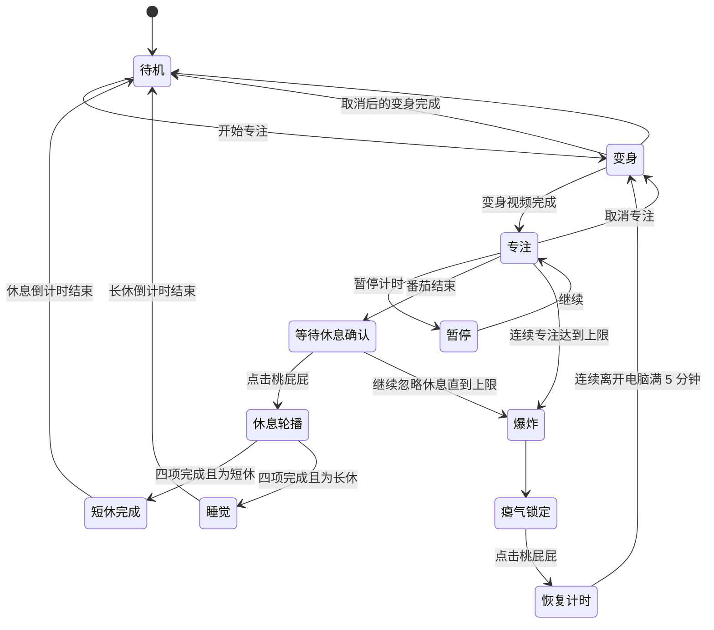

# 桃屁屁当前交互与动作切换说明

> 文档类型：当前实现说明（As-Built）  
> 对应版本：Peach Butt MVP，2026-08-24  
> 说明：本文以当前代码为准，描述桌宠、番茄计时、休息轮播、爆炸恢复、统计界面和平台状态的真实运行逻辑。旧月历、可见撤销按钮、启动自动打招呼等已经废弃的方案不作为当前功能。

## 1. 产品结构

应用由三个界面组成：

1. **桌宠窗口**：透明、置顶、可拖动，是日常主要交互入口。
2. **桃桃小屋**：查看今日能量、近 7 天趋势、行为次数和设置。
3. **全屏提醒层**：番茄结束或爆炸时出现，用大字提醒用户立即休息。

桌宠窗口默认角色尺寸为 `140`，实际透明窗口约为 `160 × 240`。窗口上方预留气泡空间，避免文字挡住角色，底部预留腿和道具空间。

## 2. 总体状态流程



## 3. 桌宠的基础交互

### 3.1 平常待机

- **每天第一次启动会播放一次完整打招呼**，气泡按时段变化（早上好 / 中午好 / 下午好 / 晚上好 / 深夜关怀，设置了昵称会带上称呼）；当天后续启动直接进入安静待机，不重复播。
- 待机播放 `idle.webm` 的 0–4 秒片段并循环。
- 动作幅度较小，用于表现呼吸、手脚轻动和小表情。
- **待机每 1–2 分钟随机插播一次小动作**（开心蹦跳约 2 秒或伸懒腰约 4.2 秒），插播完自动回到待机；非待机状态时顺延，不打断任何业务状态。
- 默认气泡文案是“我会安静陪你”。
- 状态或文案发生变化时，气泡自动显示约 `3.2 秒` 后消失。

### 3.2 鼠标悬停

- 普通状态：在桃屁屁上方显示一句短气泡。
- 专注状态：显示剩余专注时间，例如“还剩 18:42”。
- 休息状态：显示剩余休息时间，例如“休息 04:21”。
- 休息轮播状态：不显示普通气泡，改为显示本轮尚未完成的四项打卡按钮。
- 悬停本身不会播放完整打招呼视频，也不会改变当前业务状态。
- **摸头（2026-08-30 新增）**：普通待机下悬停超过 2 秒，播放 `pet.webm` 摸头享受动画（眯眼、冒小爱心），气泡“好舒服呀……再摸摸”，每次悬停最多触发一次；专注、休息轮播、有待提醒、瘪气状态不触发。

### 3.3 冷落求关注（2026-08-30 新增）

- 普通待机状态下超过 **10 分钟**没有任何用户交互（点击、打卡、开始/取消专注都算交互），插播一次 `bored.webm` 无聊动画（东张西望、撑脸叹气、耷拉脑袋），气泡“好无聊呀……理理我嘛”（有昵称时带称呼）。
- 插播后重新计时，再冷落 10 分钟才会再次触发；专注、休息、提醒等待期间不会觉得无聊。
- 素材由 MiniMax-H3 图生视频生成（参考姿势图 + 首帧），24fps 高画质管线。

### 3.4 左键单击

左键会根据当前状态执行不同动作：

| 当前状态 | 单击结果 |
| --- | --- |
| 普通待机 | 触发一次轻反馈，最多每 30 秒降低 5 点压力；短暂提示“嘿嘿，被你发现啦” |
| 正在专注 | 不退出专注、不切回站姿；短暂提示“保持专注” |
| 专注暂停 | 仍保持专注形态，提示“保持专注” |
| 番茄已结束、等待休息 | 正式开始短休或长休，并创建本轮四项健康任务 |
| 有独立生活提醒 | 直接把当前提醒记为完成，并播放完成反馈 |
| 爆炸后的瘪气状态 | 启动 5 分钟恢复计时；用户必须真正离开电脑休息 |

### 3.5 拖动

- 按住桃屁屁可以拖动整个透明窗口。
- 位移超过 5 像素后视为拖动，不再触发单击事件。
- 这样可以避免用户移动桌宠时误触状态切换。

### 3.6 右键菜单

右键菜单采用分组结构，不把全部操作堆在一个面板中：

- **专注计时**
  - 25 分钟
  - 45 分钟
  - 60 分钟
  - 开始 / 暂停 / 继续
  - 专注进行时可选择“取消专注，回到初始”
- **记录健康行为**
  - 喝水
  - 起身活动
  - 休息眼睛
  - 上厕所
- **打招呼**
- **打开桃桃小屋与设置**

完整打招呼只由右键菜单中的“打招呼”触发。

## 4. 专注逻辑

### 4.1 默认参数

| 参数 | 默认值 |
| --- | ---: |
| 单次专注 | 25 分钟 |
| 短休息 | 5 分钟 |
| 长休息 | 15 分钟 |
| 长休息周期 | 每 4 个番茄 |
| 连续专注爆炸上限 | 40 分钟 |
| 压力增长速度 | 100 ÷ 连续专注上限（默认 2.5 点/分钟，保证爆炸前能完整看到变红过程） |

### 4.2 开始专注

1. 用户从右键菜单选择时长，或直接选择开始。
2. 桃屁屁播放 `transform.webm`：0.08–9.82 秒，以 1.55 倍速度播放。
3. 运行时为变身预留 `6.5 秒`，保证旋风尾部能够完整播放。
4. 变身结束后进入专注形态，循环播放敲电脑视频。

### 4.3 专注中的表现

- 使用 `focus.webm` 的 0.35–3.67 秒稳定敲键盘片段循环。
- 点击桃屁屁只提示“保持专注”，不会切回待机，也不会取消计时。
- 鼠标悬停显示剩余时间。
- 暂停后计时停止，平台状态显示“专注暂停”；角色仍保持专注形态。
- 暂停期间不计入连续专注时长。

### 4.4 取消专注

1. 右键选择“取消专注，回到初始”。
2. 当前番茄归零，连续专注累计清除。
3. 播放一次变身视频，文案为“专注结束，变回陪伴模式”。
4. 变身结束后回到待机轻动作。

### 4.5 番茄结束

番茄归零后不会自动进入休息，而是进入 `awaiting_rest_confirmation`：

- 全屏出现活动、喝水、上厕所、护眼四条动态大字。
- 同时发送系统通知：“这一轮结束啦，点我开始休息”。
- 桌宠显示活动提醒，气泡为“点我开始休息”。
- 在用户点击桃屁屁之前，连续专注仍在累计。
- 用户点击后才真正开始短休或长休倒计时。

## 5. 每轮休息与四项打卡

### 5.1 本轮任务

每一次番茄后的休息都会建立四项任务：

1. 活动一下（内部类型名仍为 `stand`）
2. 喝水
3. 上厕所
4. 护眼

默认轮播顺序为：

```text
活动一下 → 喝水 → 上厕所 → 护眼 → 回到仍未完成的第一项
```

### 5.2 动画轮播时长

| 任务 | 角色状态 | 单次完整播放时间 |
| --- | --- | ---: |
| 活动一下 | `activity` | 4 秒 |
| 喝水 | `water-prompt` | 8.35 秒 |
| 上厕所 | `toilet` | 5.8 秒 |
| 护眼 | `eye-strain` | 5 秒 |

- 一个动作播放完才进入下一个，不按每秒强制切换。
- 用户完成当前项目后，会立即跳到下一个未完成项目。
- 用户完成非当前项目时，当前视频不会被无故从头重播。
- 应用重启后可以从保存的本轮任务继续，但当前片段会从片头重新播放。

### 5.3 悬停打卡

休息期间把鼠标放到桃屁屁上，会出现四个小按钮：

- 喝水
- 活动一下
- 护眼
- 上厕所

用户做完哪一项就点击哪一项。点击后：

1. 该项目从本轮待办中立即移除。
2. 写入完成时间和从本轮休息开始到完成的响应时长。
3. 增加对应健康分和今日行为次数。
4. 同一轮中未完成的项目继续轮播，不等到下一次休息。

### 5.4 短休和长休的结尾

- **短休**：四项全部完成后，桃屁屁进入安静休息状态，等待休息倒计时结束。
- **长休**：第 4 个番茄仍然先轮播并完成四项；四项全部完成后才播放睡觉循环视频。
- 休息倒计时结束后，系统记录一次 `pomodoro_break`，然后回到待机。

## 6. 压力、久坐爆炸与恢复

### 6.1 连续专注如何累计

- 连续专注从第一次开始专注时建立起点。
- 正常专注和“番茄结束但还没点击休息”的时间都会继续累计。
- 暂停、普通待机和已开始的休息不会增加连续专注时长。
- 点击开始休息、取消专注或发生爆炸会清除连续专注起点。
- 应用重启会恢复可靠的连续专注进度，但不会把关机时间误算进去。

### 6.2 压力表现

- 压力范围为 0–100。
- 压力增速由连续专注上限推导：`100 ÷ 上限分钟数`（默认上限 40 分钟 → 2.5 点/分钟），因此压力曲线和爆炸时机始终同步——压力到达 100 的时刻就是连续专注到达上限的时刻。
- 压力达到 55 后进入 `pressure` 视觉状态。
- `pressure.webm` 不自动循环，而是根据 55–100 的压力值在 0–5.3 秒时间线上取对应画面，因此压力越高，角色越红、越难受。
- 压力达到 80 后，提示文案变为“快要爆炸了！现在就起来活动”。

### 6.3 爆炸触发

当前主要爆炸条件是连续专注达到设置的上限，默认 `40 分钟`。等待用户点击休息的时间也包括在内。

爆炸发生时：

1. 当前番茄被重置。
2. 当前提醒和休息任务清空。
3. 播放爆炸动效。
4. 全屏显示“快去休息啦！”。
5. 桌宠小窗在全屏提醒期间隐藏，避免屏幕上出现第二只桃屁屁。
6. 爆炸层约 5.2 秒后关闭。
7. 桃屁屁进入瘪气锁定状态，不能再次开始专注。

### 6.4 爆炸扣分

同一天内的爆炸惩罚逐次增加：

| 当天第几次爆炸 | 计划扣分 |
| --- | ---: |
| 第 1 次 | 15 |
| 第 2 次 | 30 |
| 第 3 次及以后 | 50 |

实际扣分不会超过当前分数，因此每日能量不会被扣成负数。

### 6.5 瘪气恢复

1. 爆炸后，用户先点击瘪掉的桃屁屁，明确开始恢复。
2. 系统开始记录恢复倒计时。
3. 必须同时满足：从点击开始经过 5 分钟，并且系统连续空闲达到 5 分钟。
4. 仅等待时间流逝但仍操作电脑，不能恢复。
5. 恢复期间 Mac 菜单栏或 Windows 状态会显示剩余恢复时间。
6. 条件满足后恢复值直接回到 100，并播放变身动画。
7. 变身完成后解除专注锁，回到正常待机。

## 7. 独立生活提醒

除每轮番茄后的固定四项任务外，当前版本还保留独立的间隔提醒：

| 提醒 | 默认间隔 |
| --- | ---: |
| 喝水 | 45 分钟 |
| 活动一下 | 50 分钟 |
| 上厕所 | 120 分钟 |
| 护眼 | 20 分钟 |

运行规则：

- 专注时到期的提醒先延后，不打断专注。
- 结束专注后按队列一次展示一个提醒。
- 正在展示其他提醒或正在进行本轮休息时，不再叠加新的提醒。
- 瘪气锁定期间不展示普通生活提醒。
- 完成提醒后，下一次提醒从完成时间重新计算。

升级表现：

- 喝水提醒持续 15 分钟仍未处理：切换为干裂状态，气泡显示“快喝水，我干裂啦”。
- 完成喝水后：从干裂视频的喝水段开始播放，表现逐渐恢复水润。
- 护眼提醒持续 10 分钟仍未处理：切换为眼睛红、干裂的夸张状态。

## 8. 动作素材与切换表

| 视觉状态 | 素材/时间段 | 播放方式 | 进入条件 | 结束方式 |
| --- | --- | --- | --- | --- |
| `idle` | `idle.webm` 0–4s | 循环 | 无更高优先级状态 | 被其他状态覆盖 |
| `greeting` | `greeting.webm` 0.1–9.92s | 单次完整播放 | 右键“打招呼” | 停在稳定末帧，随后待机 |
| `transform` | `transform.webm` 0.08–9.82s，1.55× | 单次 | 开始、取消或恢复专注 | 约 6.5s 后进入目标状态 |
| `focus` | `focus.webm` 0.35–3.67s | 循环 | 专注或专注暂停 | 休息、取消或爆炸 |
| `activity` / `stretch` | `activity.webm` 0–4s | 循环 | 活动任务或番茄结束待确认 | 打卡或切换任务 |
| `water-prompt` | `dry.webm` 1.45–9.8s | 单次 | 喝水提醒/休息轮播 | 停末帧或切换任务 |
| `dry` | `dry.webm` 0.08–1.45s | 单次 | 喝水提醒忽略 15 分钟 | 保持干裂末帧直到完成 |
| `hydrating` | `dry.webm` 1.45–9.8s | 单次 | 干裂后确认喝水 | 播放完成后待机 |
| `toilet` | `toilet.webm` 0.85–6.65s | 单次 | 如厕提醒/轮播 | 停末帧或切换任务 |
| `eye-strain` / `eye-rest` | `eye-strain.webm` 0–5s | 单次 | 护眼任务或逾期提醒 | 停末帧或切换任务 |
| `sleep` | `sleep.webm` 0.05–4.9s | 循环 | 长休四项全部完成 | 长休结束 |
| `pressure` | `pressure.webm` 0–5.3s | 压力值控制画面 | 压力 ≥55 | 休息降压或爆炸 |
| `exploding` | `explosion.webm` | 单次、全屏 | 连续专注达到上限 | 进入瘪气锁定 |
| `deflated` | `deflated.png` | 静态 | 爆炸后 | 真实休息满 5 分钟 |

所有视频共用 `480 × 500` 透明画布和统一底部锚点，角色切换时媒体容器尺寸不变，避免悬停或状态切换时突然缩放。

## 9. 视觉状态优先级

当多个条件同时存在时，优先级从高到低如下：

1. 正在爆炸
2. 爆炸后的瘪气/恢复锁
3. 本轮休息当前任务
4. 本轮四项全部完成后的短休或睡觉
5. 番茄结束、等待用户点击休息
6. 独立生活提醒及其逾期形态
7. 变身过渡
8. 久坐压力形态
9. 专注敲电脑
10. 手动打招呼
11. 短暂点击反馈
12. 普通待机

该优先级保证爆炸、恢复锁和休息任务不会被普通点击或打招呼覆盖。

## 10. 气泡与全屏提醒

### 10.1 普通气泡

- 位于桃屁屁头顶附近。
- 一次只显示一句短文案。
- 默认显示 3.2 秒后消失。
- 不包含“撤销”“稍后”“反馈”等多余按钮。
- 专注时优先显示倒计时，休息时优先显示休息倒计时。

### 10.2 休息打卡气泡

- 只在已经点击开始休息、并且鼠标悬停时显示。
- 使用 2 × 2 小按钮布局。
- 只显示本轮未完成项目。
- 点击完成后按钮立刻消失。

### 10.3 全屏提醒

- 番茄结束：四条大字约每 2.05 秒轮换一次，整个提醒约 8.6 秒。
- 爆炸：显示爆炸视频和“快去休息啦！”，约 5.2 秒。
- 提醒层不抢键盘焦点、不接收鼠标事件。
- 提醒期间桌宠小窗临时隐藏，关闭后恢复。

## 11. 健康分与统计

### 11.1 每日能量

- 每天从 0 分开始。
- 没有总分上限。
- 界面上的基础进度条以 100 为视觉目标，超过 100 后仍显示真实分数，并显示超出值。

### 11.2 行为权重和每日奖励次数

| 行为 | 每次加分 | 每天最多奖励次数 |
| --- | ---: | ---: |
| 喝水 | 8 | 5 |
| 活动一下 | 12 | 4 |
| 上厕所 | 6 | 4 |
| 护眼 | 5 | 6 |
| 完成番茄休息 | 10 | 4 |

超过每日奖励次数后仍会记录行为，但不再重复加分。

### 11.3 统计内容

当前保存并统计：

- 每日最终能量、最低能量
- 有效活跃时间
- 专注时间和完成番茄数
- 喝水、活动、上厕所、护眼次数
- 有效休息次数
- 爆炸次数、忽略提醒次数、最高压力
- 各状态时长：待机、专注、等待休息、短休、长休、瘪气、恢复

状态时长跨午夜时会自动拆分到对应日期，避免整段记到错误的一天。

## 12. 桃桃小屋界面

桃桃小屋当前只展示周视图，不展示月历。

主要区域：

1. **桃桃能量**：显示真实分数和 0–100 的基础目标进度条。
2. **今日指标**：完成番茄数、有效休息次数、系统活跃时长。
3. **近 7 天成长路线**：响应式折线图，窗口变化时自动重新排布。
4. **行为入口**：喝水、活动一下、护眼、上厕所图标和今日次数。
5. **陪伴角色**：统计页打开时播放一轮敲电脑，随后停在稳定帧；鼠标放上去再播放一轮。
6. **设置**：昵称（怎么称呼你）、专注时长、连续专注上限、短休、长休、长休周期，以及四类独立提醒的开关和间隔。设置了昵称后，每日问候、提醒、压力告警、瘪气求助等气泡会带上称呼。

统计页中的行为图标不会直接记一次行为；点击后关闭统计页，引导用户回到桌宠完成反馈，避免误触增加数据。

后台仍保存当月完整数据，并通过内部快照提供 `monthStats`，但当前前端没有月视图入口。

## 13. Mac 与 Windows 状态显示

### 13.1 macOS

- 专注：菜单栏显示“专注 MM:SS”。
- 暂停：显示“专注暂停 MM:SS”。
- 短休/长休：显示对应休息倒计时。
- 等待用户点击休息：显示“该休息啦”。
- 爆炸锁定：显示“快去休息”。
- 恢复：显示“恢复 MM:SS”。
- 待机：清空菜单栏倒计时，只保留托盘提示。

### 13.2 Windows

- 托盘提示显示当前状态和剩余时间。
- 任务栏进度条显示专注或休息进度。
- 暂停使用暂停样式。
- 爆炸使用错误样式和满进度。
- 待机移除任务栏进度。

Windows 状态映射已通过自动测试，但仍需要 Windows 10/11 实机验证窗口置顶、任务栏表现和安装包签名体验。

## 14. 数据保存与重启恢复

数据保存在本机 SQLite，主要包含：

- `events`：状态变化、完成行为、爆炸和扣分等事件。
- `settings`：用户设置。
- `runtime_state`：健康状态、番茄状态、休息队列、恢复起点和状态时长检查点。
- `daily_stats`：每日聚合统计。
- `usage_sessions`：每段状态的开始、结束和时长。

应用重启后会恢复：

- 正在进行或暂停的番茄
- 等待休息确认状态
- 当前短休/长休和未完成任务
- 瘪气锁定与恢复计时
- 当日分数、压力、计数和连续专注进度

停机时间不会直接算成专注或恢复时间；不可靠或损坏的时间检查点会安全回退，避免启动后立刻误爆炸。

## 15. 当前实现边界与后续优化点

以下内容是代码当前真实存在的边界，便于下一轮设计决策：

1. ~~**压力动画与 40 分钟爆炸并非完全同步**~~ **已修复（2026-08-30）**：压力增速改为 `100 ÷ 连续专注上限`，压力到 100 的时刻即爆炸时刻，变红过程完整可见。设置中的 `pressurePerMinute` 字段仅为向后兼容保留，不再驱动引擎。
2. **两套提醒机制并存**：每个番茄休息固定有四项轮播，同时还保留按 20/45/50/120 分钟触发的独立提醒。如果产品最终只希望在番茄休息中提醒，应关闭或移除独立调度器。
3. ~~**部分短暂反馈没有专用动效**~~ **已修复（2026-08-26）**：`happy` 和 `rest` 已补拍并接入播放器。
4. **月数据已保存但没有展示**：后台提供当月数据，前端按最终 MVP 决策只显示近 7 天。
5. **撤销和稍后仅保留内部能力**：数据层仍有 20 秒撤销和提醒延后逻辑，用于兼容与测试；当前桌宠气泡和右键菜单不展示这些入口。
6. **宠物大小没有可见选择器**：系统内部支持 120–320 的角色尺寸并允许透明窗口调整，但当前设置面板不提供尺寸选项，默认值为 140。
7. **声音开关和开机启动字段存在，但当前设置面板没有对应控件**；当前动效也全部静音播放。
8. **统计页行为图标是返回桌宠的入口，不是直接打卡按钮**，因此用户需要回到桌宠再确认一次。

## 16. 主要代码对应关系

| 模块 | 文件 |
| --- | --- |
| 总运行时状态机 | `src/main/runtime.ts` |
| 番茄状态 | `src/core/pomodoro.ts` |
| 健康分、压力、爆炸 | `src/core/health-engine.ts` |
| 每轮四项任务 | `src/core/rest-session.ts` |
| 独立提醒调度 | `src/core/reminders.ts` |
| 视觉状态选择 | `src/core/pet-visual-state.ts` |
| 视频时间线 | `src/renderer/src/components/pet-motion-timeline.ts` |
| 视频播放器 | `src/renderer/src/components/PetMotion.tsx` |
| 桌宠、统计页、全屏提醒 | `src/renderer/src/main.tsx` |
| Mac/Windows 状态 | `src/core/platform-status.ts` |
| 窗口、托盘、右键菜单 | `src/main/index.ts` |
| SQLite 数据保存 | `src/main/storage.ts` |

